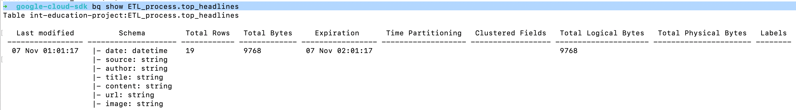
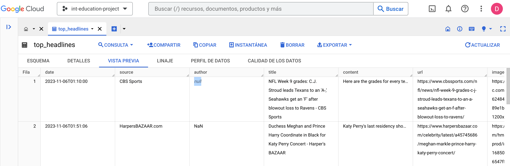

# ETL Process

Project that performs ETL process with extraction, cleaning, transformation, and loading data to GCP BigQuery.

* __Time of analysis v1:__ November 7, 2023.
* __Tools v1:__ .CSV, Python, SQL, BigQuery GCP.

## Table of contents

- [ETL Process](#etl-process)
  - [Background](#background)
  - [Getting started](#getting-started)
  - [Workflow description](#workflow-description)
  - [BigQuery: Load data with GCP SDK](#bigquery-load-data-with-gcp-sdk)

## Background

This project extracts the top headlines of the [News API](https://newsapi.org/).

## Getting started

Clone the repository in the folder:

```console
git clone git@github.com:denisseee/ETL_process.git ETL_process
cd ETL_process
```

Check your python version and install the dependencies:

```console
which python3
pip3 install pandas
pip3 install requests
pip3 install fugue
pip3 install "fugue[sql]"
python3 -m pip install python-dotenv
```

Create an ```.env``` file:

```console
touch .env
```

Add the API Key to the ```.env``` file:

```py
# .env

NEWS_API_KEY=APIKEYFROMNEWSAPI
```


Run the code to start the process: 

```console
python3 main.py
```

2 Files will generated:
* top_headlines.csv
* top_headlines_after_sql.csv

## Workflow description

### 1. Inspect

```py
df.head(5)
df.dtypes
# df.info()
df.describe()
print(df.shape) # (20, 9)
```

### 2. Transform 

```py
# Delete duplicates
df.drop_duplicates

# Missing values
df.fillna('NaN', inplace=True)

# Transform date to datetime format
# df['author'] = df['author'].astype('string') 
df['publishedAt'] = pd.to_datetime(df['publishedAt'], utc=True).dt.tz_convert(None)

# Delete rows with [Removed] news
df_filtered_index = df[df['title'] == '[Removed]'].index
df.drop(df_filtered_index, inplace=True)
df.reset_index(drop=True, inplace=True)
df.head(15)
df.shape # (19, 9)

# Change column name 
df.rename(columns = {'source.name':'source'}, inplace = True)
```

### 3. SQL 

```sql
SELECT 
    `publishedAt` AS `date`,
    `source`,
    `author`,
    `title`,
    `description`
    `content`,
    `url`,
    `urlToImage` AS `image`
  FROM 
    df 
  PRINT
```

## BigQuery: Load data with GCP SDK

First, starts GCP SDK:

```console
➜ google-cloud-sdk gcloud init
```

Select or create a project:

```
➜  google-cloud-sdk gcloud config set project `PROJECT ID`
```

Create a database:

```
➜  google-cloud-sdk 
  bq --location=US mk -d \
  --default_table_expiration 3600 \
  --description "Dataset for ETL Process." \
  ETL_process

Dataset 'ProjectName:ETL_process' successfully created.
```

Create a table:

```
➜  google-cloud-sdk 
bq load --source_format=CSV --skip_leading_rows=1 ETL_process.top_headlines 
/Users/denisse/ETL_process/top_headlines_after_sql.csv 
date:datetime,source:string,author:string,title:string,content:string,url:string,image:string           

Upload complete.
.. (1s) Current status: DONE   
```

Check the table from the terminal:

```console
➜  google-cloud-sdk bq show ETL_process.top_headlines
```

<p align="left"></p>

Watch the schema and the preview from BigQuery: [ETL_process.top_headlines](https://console.cloud.google.com/bigquery?hl=es-419&project=int-education-project&ws=!1m5!1m4!4m3!1sint-education-project!2sETL_process!3stop_headlines).

<p align="left"></p>